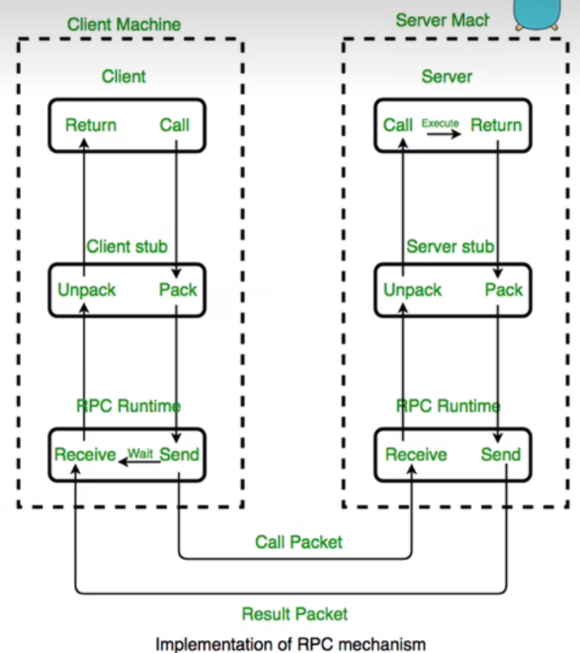

因为rpc在实验1还是核心内容，不懂的话简直无从下手，所以还是先学下rpc。

rpc 直白的说就是运行与该地址空间的程序，可以调用另一个地址空间的程序，而程序员就像调用本地程序一样，无需额外地为这个交互作用编程。RPC是一种c/s模式。

这个视频对比着lab1的代码看就能知道lab1那段rpc在做什么了：
https://www.bilibili.com/video/BV1c54y1R7oB/?spm_id_from=333.337.search-card.all.click&vd_source=4c75ee5c3c51a32b2497386bd72839c3