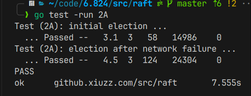

# raft part A
Implement Raft leader election and heartbeats (AppendEntries RPCs with no log entries). The goal for Part 2A is for a single leader to be elected, for the leader to remain the leader if there are no failures, and for a new leader to take over if the old leader fails or if packets to/from the old leader are lost. Run go test -run 2A to test your 2A code.

在raft 2A中我们只需要实现领导选举和心跳发送这两个功能，因此只需要看论文的前5章

`Leader election`: Raft uses randomized timers to
elect leaders. This adds only a small amount of
mechanism to the heartbeats already required for any
consensus algorithm, while resolving conflicts sim-
ply and rapidly.

## Replicated state machines
raft共识的保证：

1. safety

他们保证所有非拜占庭条件下的安全性，包括网络延迟、分区、数据包丢失、重复和重新排序。

2. fully functional(available) as long as any majority

只要大多数服务器都可以运行并且可以相互通信以及与客户端通信，它们就可以完全发挥功能（可用）。

3. not depend on timing to ensure the consistency of the logs

错误的时钟和极端的消息延迟在最坏的情况下可能会导致可用性问题, 因此不是靠全局时钟保持一致性的

4. majority respond

在常见情况下，一旦集群的大多数成员响应了单轮远程过程调用，命令就可以完成；少数缓慢的服务器不会影响整体系统性能

## 设计目标

complete and practical

safe

understandability
# raft part B
Implement the leader and follower code to append new log entries, so that the go test -run 2B tests pass.
# 实现

写到这里的时候已经实现了lab2a和lab2b，所有的实现细节其实都在论文中给出了，然后下面就说下我的实现思路。

首先不管lab2a,还是lab2b,其实我们都围绕着raft的三个子问题（因为这个lab不需要我们实现成员变更）：
 1. 领导选举
 2. 日志变更
 3. 安全性
领导选举意味着我们需要个事件，这个事件中某个节点成为领导，而日志变更也意味着一个事件：领导节点发送心跳包，给其他节点。很明显的可以看到这两个事件是互斥的，因此我们只需要设置某种时间机制。
```go
rf.heartbeatTimer = time.NewTimer(HEART_BEAT_TIMEOUT * time.Millisecond)
rf.electionTimer = time.NewTimer(time.Duration((3*HEART_BEAT_TIMEOUT + 2*rand.Intn(HEART_BEAT_TIMEOUT))) * time.Millisecond)
rf.applyCh = applyCh
rf.logEntries = make([]LogEntry, 1)
rf.nextIndex = make([]int, len(peers))
rf.matchIndex = make([]int, len(peers))
// 500ms and 1s
go rf.applyLogLoop()
go func() {
	for !rf.killed() {
		select {
		case <-rf.electionTimer.C:
			rf.mu.Lock()
			switch rf.peerType {
			case Follower:
				rf.switchType(Candidate)
			case Candidate:
				rf.startElection()
			}
			rf.mu.Unlock()
		case <-rf.heartbeatTimer.C:
			rf.mu.Lock()
			if rf.peerType == Leader {
				rf.leaderHeartBeats()
				rf.heartbeatTimer.Reset(HEART_BEAT_TIMEOUT * time.Millisecond)
			}
			rf.mu.Unlock()
		}
	}
}()
```

很明显可以看出这里设置了两个事件leaderHeartBeats()，和startElection()
```go
func (rf *Raft) startElection() {
	rf.currentTerm += 1
	rf.voteFor = rf.me
	rf.voteCnt = 1
	rf.electionTimer.Reset(time.Duration((3*HEART_BEAT_TIMEOUT + 2*rand.Intn(HEART_BEAT_TIMEOUT))) * time.Millisecond)

	for i := range rf.peers {
		if i != rf.me {
			go func(idx int) {
				rf.mu.Lock()
				args := &RequestVoteArgs{
					Term:         rf.currentTerm,
					CandidateId:  rf.me,
					LastLogIndex: len(rf.logEntries) - 1,
					LastLogTerm:  rf.logEntries[len(rf.logEntries)-1].Term,
				}
				reply := &RequestVoteReply{}
				rf.mu.Unlock()
				if rf.sendRequestVote(idx, args, reply) {
					rf.mu.Lock()
					defer rf.mu.Unlock()

					if reply.Term > rf.currentTerm {
						rf.currentTerm = reply.Term
						rf.switchType(Follower)
						return
					}

					if reply.VoteGranted && rf.peerType == Candidate {
						rf.voteCnt++
						if rf.voteCnt > len(rf.peers)/2 {
							rf.switchType(Leader)
						}
					}
				}
			}(i)
		}
	}
}
```

在选举中给其他节点发送选举请求，当其他节点收到后按照论文描述进行回复（整个论文对这个算法描述特别清楚，因此这个实验的难度在于实际的代码语言细节）
```go
func (rf *Raft) RequestVote(args *RequestVoteArgs, reply *RequestVoteReply) {
	// Your code here (2A, 2B).
	rf.mu.Lock()
	defer rf.mu.Unlock()
	reply.Term = rf.currentTerm
	if args.Term < rf.currentTerm || (args.Term == rf.currentTerm && rf.voteFor != -1 && rf.voteFor != args.CandidateId) {
		reply.VoteGranted = false
		return
	}
	if args.Term > rf.currentTerm {
		rf.currentTerm = args.Term
		rf.switchType(Follower)
	}

	lastLogIndex := len(rf.logEntries) - 1
	if rf.logEntries[lastLogIndex].Term > args.LastLogTerm || (rf.logEntries[lastLogIndex].Term == args.LastLogTerm && lastLogIndex > args.LastLogIndex) {
		reply.VoteGranted = false
		return
	}
	reply.VoteGranted = true
	rf.voteFor = args.CandidateId
	rf.electionTimer.Reset(time.Duration((3*HEART_BEAT_TIMEOUT + 2*rand.Intn(HEART_BEAT_TIMEOUT))) * time.Millisecond)
}
```

然后心跳机制,lab b里面只是用到matchIndex和nextIndex这两个特殊的数组
```go
func (rf *Raft) leaderHeartBeats() {
	for i := range rf.peers {
		if i != rf.me {
			go rf.heartBeat(i)
		}
	}
}

func (rf *Raft) heartBeat(idx int) {
	rf.mu.Lock()
	if rf.peerType != Leader {
		rf.mu.Unlock()
		return
	}

	prevLogIndex := rf.nextIndex[idx] - 1
	entries := make([]LogEntry, len(rf.logEntries[prevLogIndex+1:]))
	copy(entries, rf.logEntries[(prevLogIndex+1):])
	// fmt.Println(idx, entries, prevLogIndex, rf.logEntries, rf.me, rf.currentTerm)
	args := &AppendEntriesArgs{
		Term:         rf.currentTerm,
		LeaderId:     rf.me,
		PrevLogIndex: prevLogIndex,
		PrevLogTerm:  rf.logEntries[prevLogIndex].Term,
		Entries:      entries,
		LeaderCommit: rf.commitIndex,
	}

	reply := &AppendEntriesReply{}
	rf.mu.Unlock()
	if rf.sendRequestAppendEntries(idx, args, reply) {
		if rf.killed() {
			return
		}
		rf.mu.Lock()
		if rf.currentTerm != args.Term {
			rf.mu.Unlock()
			return
		}
		if reply.Success {
			// fmt.Println("GGGG")
			// fmt.Println(args.Entries)
			rf.matchIndex[idx] = args.PrevLogIndex + len(args.Entries)
			rf.nextIndex[idx] = rf.matchIndex[idx] + 1

			//how much log can commit
			matchLogs := make([]int, len(rf.peers))
			for i := range matchLogs {
				matchLogs[i] = rf.matchIndex[i]
			}
			sort.Ints(matchLogs)
			// fmt.Println("ccc")
			if matchLogs[len(matchLogs)/2] > rf.commitIndex {
				rf.commitIndex = matchLogs[len(matchLogs)/2]
				// fmt.Println(rf.commitIndex)
			}
		} else if reply.Term > rf.currentTerm {
			rf.currentTerm = reply.Term
			rf.switchType(Follower)
		} else {
			rf.nextIndex[idx] = args.PrevLogIndex
		}
		rf.mu.Unlock()
	}
}
```

收到心跳的回复：
```go
func (rf *Raft) RequestAppendEntries(args *AppendEntriesArgs, reply *AppendEntriesReply) {
	// fmt.Println("111111111111111")
	rf.mu.Lock()
	defer rf.mu.Unlock()
	reply.Term = rf.currentTerm
	if args.Term < rf.currentTerm {
		reply.Success = false
		return
	}
	// fmt.Println(rf.me, rf.commitIndex)
	rf.electionTimer.Reset(time.Duration((3*HEART_BEAT_TIMEOUT + 2*rand.Intn(HEART_BEAT_TIMEOUT))) * time.Millisecond)
	if args.Term > rf.currentTerm {
		rf.currentTerm = args.Term
		rf.switchType(Follower)
	}
	lastLogIndex := len(rf.logEntries) - 1
	DPrintf("%v %v\n", lastLogIndex, args.PrevLogIndex)
	if lastLogIndex < args.PrevLogIndex || rf.logEntries[args.PrevLogIndex].Term != args.PrevLogTerm {
		reply.Success = false
		return
	}
	reply.Success = true
	DPrintf("args:%v %v\n", rf.me, rf.logEntries)
	DPrintf("ar:%v %v %v\n", args.Entries, args.LeaderId, args.PrevLogIndex)
	if len(args.Entries) != 0 {
		rf.logEntries = rf.logEntries[:args.PrevLogIndex+1]
		rf.logEntries = append(rf.logEntries, args.Entries...)
	}
	rf.commitIndex = args.LeaderCommit
	if len(rf.logEntries)-1 < rf.commitIndex {
		rf.commitIndex = len(rf.logEntries) - 1
	}

}
```

这里part a的内容就实现完了，然后是part b还有一部分就是安全性，安全性里面规定了如何确定commitId,如果安全更新状态：
```go
func (rf *Raft) applyLogLoop() {
	for !rf.killed() {
		rf.mu.Lock()
		// fmt.Println(rf.commitIndex, rf.lastApplied)
		DPrintf("%v %v %v %v\n", rf.me, rf.lastApplied, rf.commitIndex, rf.voteFor)
		if rf.commitIndex > rf.lastApplied {
			DPrintf("%v %v\n", rf.me, rf.logEntries)
			// fmt.Println(rf.commitIndex, rf.lastApplied)
			for i := rf.lastApplied + 1; i <= rf.commitIndex; i++ {
				rf.lastApplied++
				rf.applyCh <- ApplyMsg{
					CommandValid: true,
					Command:      rf.logEntries[i].Command,
					CommandIndex: i,
				}
				// fmt.Println("Ffff")
			}
			// fmt.Println(rf.commitIndex, rf.lastApplied)
		}
		rf.mu.Unlock()
		time.Sleep(HEART_BEAT_TIMEOUT * time.Millisecond)
	}
}
```




原本想详细的写写的，后面发现打字还是有点太累了。。。加上part b写完才想起要写日志，所以就处略的写了下
