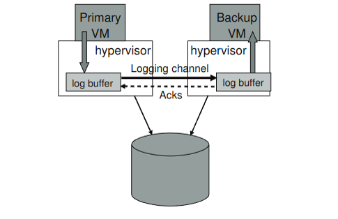
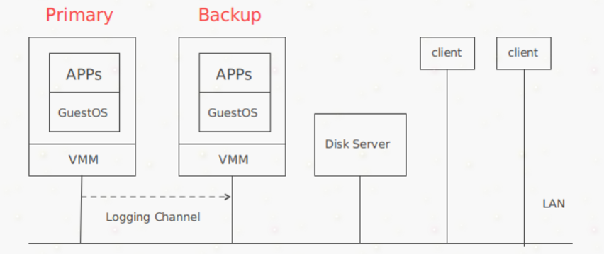
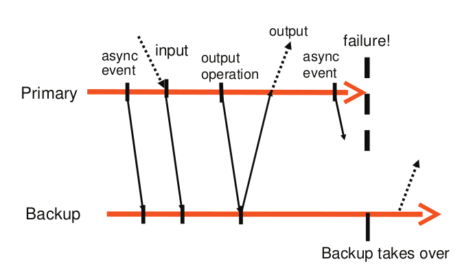

*这一讲将探讨容错和复制的问题，以及VMware FT这篇论文*

论问地址 ：http://nil.csail.mit.edu/6.824/2020/papers/vm-ft.pdf

# 论文解读

本论文主要介绍了一个用于提供 容错虚拟机 (fault-tolerant virtual machine) 的企业级商业系统，该系统包含了两台位于不同物理机的虚拟机，其中一台为 primary ，另一台为 backup ，backup 备份了 primary 的所有执行 。当 primary 出现故障时，backup 可以上线接管 primary 的工作，以此来提供容错 。

虚拟机原理：Hypervisor(没什么好讲的)

# 基本架构

Primary和Backup运行在同一个网络的不同的物理机下，两者可以访问共同的disk server，即图片中的shared disk。

Primary向外界发送心跳，表示自己存在，因此所有网络输入或io设备等输入都进入primary。

## 如何进行备份呢？

primary的所有输入都通过Logging channel这个网络通道发送给backup。他们都会对接受结果做指令计算(即认为为函数调用，然后返回函数调用结果)，他们的返回结果相同，但是只有primary会将调用的结果发送给client，backup的结果会被丢弃。

## 如何监管primary和backup是否失效呢？

系统使用primary vm和backup vm之间的心跳包和logging channel上的流量监控来检查primary 和 backup是否失效。此外，必须确保primary vm和 back up
只有一个接管执行。

## 确定性重放

由上文可知，VM-FT 建模为确定性状态机的复制 。对于一系列输入，对 primary 的执行进行记录并确保 backup 以相同方式执行的基本技术称为 `确定性重放` 。

primary 的操作中包含了 `确定性操作` 和 `不确定性操作`。确定性操作在 primary 和 backup 上的执行结果是相同的，不确定性操作包括：

1. 来自 client 的输入，这些输入可能在任何时候到达
2. 非确定性指令，如随机数生成指令、在不同时间获得时间的指令、生成设备唯一 ID 的指令等
3. 多核并发，服务中的指令会在不同的核上何以某种方式交错执行，执行顺序不可预测(本论文中的方法只针对单核处理器，不解决此问题)

确定性重放记录 primary 的输入和 primary 执行相关的所有可能的不确定性，记录在 log entry 流中，发送给 backup 并使其重放 

log entry中应该包含：
1. 事件发生的时的指令号
2. 类型：指明是网络输入还是其他指令
3. 数据：数据包的数据，若是不确定指令，则此数据是该数据在primary的执行结果，所以backup就可以对该指令提供与primary相同结果

## 不确定性指令执行过程：
primary：
1. Hypervisor在primary执行指令时设置中断(这个中断什么意思？)
2. Hyperviosr执行指令并记录结果
3. 发送结果和指令序号到backup
backup:
1. Hypervisor读log entry， 在该指令序号处设置中断
2. Hypervisor应用从primary执行得到的结果，自己产生的结果被丢弃，从而保证主备一致性

## 输出要求和规则
`输出要求`：若primary发生故障后且backup接管后, backup必须以一种与原primary已发送到外部的输出完全一致的方式运行。

可能有一种特殊情况会发生：如果 primary 在执行输出操作后立即故障，backup 在完成接管之前，可能还未执行到同样的输出操作，就被其他不确定事件所影响（ 如计时中断 ），这样 backup 就无法以与 primary 发生故障时的相同状态上线，为此提出了 `输出规则` 。

`输出规则`：primary必须延后将输出发送到外部世界的动作，知道backup已经接收并确认与产生该输出相关的log entry。

基于输出规则， primary和backup的交互如下：

从这幅图中不难看出，log entry同步时采用异步操作，因此不会堵塞住下一个的输入，当输入来临时，可以清楚的看到，当要执行outoperation操作时，等待了backup的out操作结束。

*一些故障发生情况：*

 1. 如果 primary 在收到 ACK 之前故障，它不会返回结果给 client ，由于 backup 的输出会被丢弃，所以两者在 client 看来是一致的，即未收到 server 回复 。
 2.如果 primary 在发送输出后故障，backup 在接管后也执行发送，client 会收到两次输出 。但是这种情况不会造成不良后果，因为对于 TCP 连接来说，它会处理重复的数据包；对于磁盘来说，会对同一块存储区覆盖写入 。（也就说当backup接管后，会重放最会后一次指令？）  

## 故障检测
两种 VM 都有可能发生故障：

如果是 backup 故障，primary 将停止在 logging channel 上发送 log entry ，并继续执行
如果是 primary 故障，backup 会继续重放 log entries ，重放结束后 上线 成为 primary ，此时，它可以向外界生成输出 。
VM-FT 检测故障的方式有 UDP 心跳检测和监控 logging channel 中的流量以及 backup 发送给 primary 的 ACK 。若心跳或日志流量停止的时间超过了特定超时时间（ 大约几秒 ），就会声明故障 。

这样的故障检测方法，在有网络故障时，容易遇到 split-brain 问题：即 primary 和 backup 之间通信断开，但此时 primary 还在运行，若 backup 此时上线，会造成两者同时执行的问题，可能会导致数据损坏 。

为解决 split-brain 问题，使 Disk Server 支持 atomic test-and-set 测试，即在 Disk Server 上维护一个 flag ，第一个访问此 flag 的 VM 会成为 primary ，第二个访问此 flag 的 VM 不会上线 。（ 类似于锁 ）

## 恢复冗余

primary 发生故障，backup 上线时，在新的物理机上建立 backup ，恢复冗余，继续进入到容错状态 。

VM vSephere 实现了一个集群服务，用于维护管理和资源信息。当发生故障时，集群服务根据资源使用情况和其他约束来确定新的 backup 的最佳服务器，并将其复制成为 backup 。其结果是，VM-FT 通常可以在服务器发生故障后几分钟内重新建立冗余，而在执行容错转移时不会产生任何明显的中断 。
